# Phase 0: Basis (The Foundation)

## 1. Webclient (React)
*   **UI Focus:** A clean, single search page mimicking a premium financial tool.
*   **Behavior:** Users enter a stock, hit search, and see results populate progressively.
*   **Information Flow (ndJSON):** Instead of waiting for a single, delayed JSON response, the client listens to an HTTP stream. As the server finishes analyzing individual stocks, the client renders them immediately on the screen, masking the overall wait time.

## 2. Core API Server (Node.js)
*   **The Traffic Cop & DB Gatekeeper:** The sole entry point for user requests and the *only* service with credentials to access PostgreSQL and Redis.
*   **Request Collapsing & Job Creation:** When a user searches a stock, Core generates a unique `ScanJobId` (UUID). If multiple users search the same stock simultaneously, Core maps them to the same `ScanJobId` to prevent duplicate scraping.
*   **Information Flow (The Scatter-Gather):**
    1.  Core checks **Redis**. If fresh, returns immediately.
    2.  If cache miss, Core sends an HTTP POST to the Tracking Service with the stock and `ScanJobId`.
    3.  **Crucial Step:** The Tracking Service responds to the HTTP request immediately with the `expected_article_count`.
    4.  Core initializes an `InFlight` map: `InFlight[ScanJobId] = { expected: X, received: 0, stream: ReactResponseConnection, buffer: [] }`.
*   **Asynchronous Listener & Aggregator:** Listens to the `results` channel on **RabbitMQ**. 
    *   As individual analyzed articles arrive, Core writes the snippet to **Postgres**.
    *   Core increments `received`.
    *   Once `received === expected` (or a 15-second safety timeout hits), Core calculates the final average score, updates **Redis**, streams the final stock JSON over the ndJSON connection, and closes the client's HTTP stream.

## 3. Tracking & Scraping Service (Node.js)
*   **The Sole Scraper:** The only service allowed to touch the outside internet, centralizing rate limits and proxy management. Has no access to Postgres.
*   **Information Flow (The Split):**
    1.  Receives the HTTP scrape command and `ScanJobId` from Core.
    2.  Scrapes the web and counts the articles (e.g., 5 articles found).
    3.  Returns the integer `5` back to Core via the open HTTP connection.
    4.  Pushes 5 individual tasks to **RabbitMQ** on a high-priority channel, tagging each with the `ScanJobId` and the raw text snippet.

## 4. Sentiment Analyzer (Python)
*   **The Stateless Brain:** Constantly polls RabbitMQ. It holds no database connections and stores zero state, meaning you can horizontally scale it instantly.
*   **Processing:** Runs the raw text through a financial NLP model (e.g., FinBERT) to calculate a score (-1.0 to +1.0).
*   **Information Flow:** Takes the task, computes the score, and immediately publishes a message back to the RabbitMQ `results` channel containing: `ScanJobId`, `Score`, `Snippet`, and `URL`.

---

# Increment 1: Categorical Search (GICS Codes)
*   **Objective:** Allow users to search by broad traditional industry categories.
*   **Mapping:** Integrate a static mapping of numeric GICS codes to human-readable strings (e.g., "Information Technology", "Health Care").
*   **Information Flow:** 
    1.  User searches "Tech". Core intercepts and maps this to 5 stocks (e.g., AAPL, MSFT...).
    2.  Core generates 5 distinct `ScanJobIds`.
    3.  Core fires 5 parallel HTTP requests to the Tracking Service.
    4.  As each stock's aggregation finishes via RabbitMQ, Core streams that specific stock's final score to the React client via ndJSON.

---

# Increment 2: Semantic Search (Vector Embeddings)
*   **Objective:** Allow users to search modern, nuanced topics (e.g., "Artificial Intelligence").
*   **Infrastructure Upgrade:** Enable the `pgvector` extension in your existing PostgreSQL database.
*   **Data Ingestion:** Download SEC 10-K "Item 1" filings, chunk the text, embed it, and store vectors in Postgres.
*   **Information Flow:** 
    1.  Core receives topic query. Checks static GICS map first (for speed).
    2.  If no match, Core embeds the query string and queries Postgres via vector math to find the 5 closest matching stocks.
    3.  Flow resumes exactly as Increment 1, creating parallel `ScanJobIds` and streaming results via ndJSON.

---

# Increment 3: Background Tracking (The S&P 500 Prefetch)
*   **Objective:** Ensure the most popular stocks load instantly (Cache Hit) by pre-calculating them.
*   **The Scheduler:** The Tracking Service runs a CRON job against a static list (managed in its own local Redis Tracking List, each entry having a priority, TTL, and interval).
*   **Information Flow (Background Loop):**
    1.  Tracker triggers daily scrape. Pushes to RabbitMQ on a **low-priority channel** with a distinct `BackgroundJobId`.
    2.  Analyzer processes and pushes to the `results` channel.
    3.  Core Server consumes the result. It notices this is a `BackgroundJobId` (no user HTTP stream is waiting).
    4.  Core silently aggregates the data in the background, executing bulk-inserts to **Postgres** and updating **Redis**.

---

# Increment 4: Watchlists & Real-Time Alerts
*   **Objective:** Introduce user state and push notifications.
*   **User Management:** Integrate an Auth provider. Core manages relational `Users` and `Watchlists` tables in PostgreSQL.
*   **Information Flow (Watchlist Registration):** 
    1. User adds "XYZ" to watchlist via HTTP. 
    2. Core saves to Postgres. 
    3. Core sends HTTP command to Tracking Service to add "XYZ" to its tracking list.
*   **Information Flow (Real-Time Push via SSE):** 
    1. Upgrade React-to-Core connection to Server-Sent Events (SSE). 
    2. When Core receives a finalized score from RabbitMQ (either from live search or background task), it checks if the stock is in Postgres `Watchlists`.
    3. If the score shifted drastically (e.g., +0.8 to -0.5), Core pushes an SSE alert to any online user who tracks that stock.

---

# Increment 5: Trending Momentum Stocks
*   **Objective:** Automatically track obscure stocks that suddenly go viral.
*   **The Trending Service:** A new lightweight Node service that pings APIs (like NewsAPI or Reddit) daily.
*   **Information Flow:**
    1.  Trending Service spots a volume spike for a random penny stock.
    2.  Sends HTTP command to Tracking Service: "Track this stock every hour for the next 48 hours."
    3.  Tracker pushes to RabbitMQ -> Analyzer -> Core.
    4.  Core updates **Redis** with a strict, short Time-To-Live (TTL) expiration, guaranteeing users viewing the "Trending" tab are seeing live hype.

